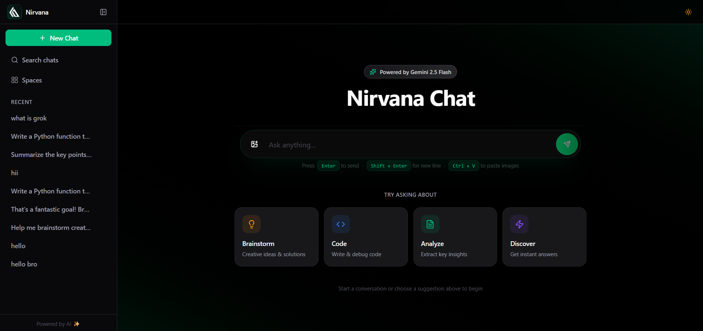
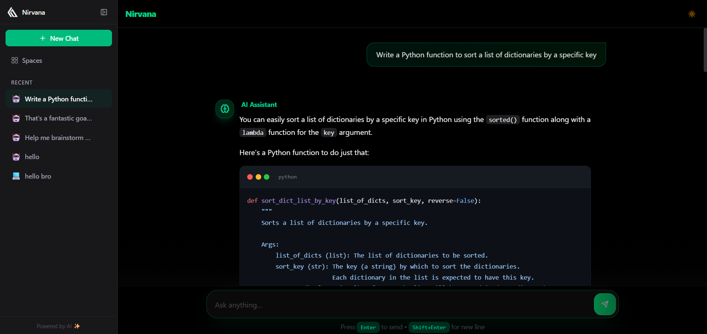
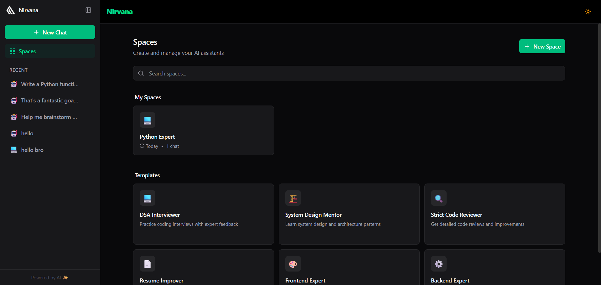

# 🌟 Nirvana Chat

<div align="center">


**A modern AI chat application powered by Google's Gemini AI with customizable personas and spaces**

[Features](#-features) • [Demo](#-demo) • [Installation](#-installation) • [Usage](#-usage) • [Tech Stack](#-tech-stack)

</div>

---

## ✨ Features

### 🎭 **Multi-Persona AI Chat System**

Transform your AI conversations with specialized personas tailored for specific tasks:

- **7 Built-in Expert Personas**
  - **General Assistant** - Your go-to helper for everyday questions and tasks
  - **DSA Interviewer** - Practice data structures and algorithms with an expert interviewer who provides hints, analyzes complexity, and gives constructive feedback
  - **System Design Mentor** - Learn scalable architecture, distributed systems, and design patterns with a senior software architect
  - **Strict Code Reviewer** - Get detailed code reviews focusing on bugs, security, performance, and best practices
  - **Resume Improver** - Enhance your resume with ATS-friendly formatting, action verbs, and quantifiable achievements
  - **Frontend Expert** - Master React, TypeScript, CSS, and modern web development with component architecture guidance
  - **Backend Expert** - Build robust APIs, optimize databases, and design microservices with backend engineering expertise

- **Create Custom Personas**
  - Design AI assistants with unique personalities and expertise
  - Define custom system prompts to guide AI behavior
  - Perfect for specialized domains like legal advice, medical consultation, creative writing, language learning, and more
  - Each persona maintains its own context and conversation style

- **Organized Persona Spaces**
  - Dedicated workspace for each persona
  - View all conversations grouped by persona
  - Switch between different AI experts seamlessly
  - Keep interview prep separate from code reviews and system design discussions

### 💬 **Intelligent Chat Interface**

A feature-rich chat experience that goes beyond simple question-and-answer:

- **Real-time Streaming Responses**
  - See AI responses as they're being generated, word by word
  - Powered by Google's Gemini 2.5 Flash model for fast, intelligent responses
  - Stop generation mid-stream if you get the answer you need

- **Image Upload & Vision Capabilities**
  - **Upload images** via click or drag-and-drop (up to 3 images per message)
  - **Paste images** directly from clipboard using Ctrl+V
  - Support for screenshots, photos, diagrams, and more
  - Gemini AI analyzes images and provides context-aware responses
  - Perfect for code debugging (upload screenshots), diagram explanations, visual questions, and more
  - Image previews with easy removal before sending
  - Maximum 3 images per message, 20MB per image
  - Supports all common formats: JPEG, PNG, GIF, WebP

- **Rich Markdown Support**
  - Beautiful rendering of formatted text, lists, tables, and quotes
  - **Syntax-highlighted code blocks** for 100+ programming languages via Shiki
  - GitHub Flavored Markdown support for task lists, tables, and strikethrough
  - Inline code formatting and multi-line code blocks

- **Powerful Message Actions**
  - **Copy to Clipboard** - One-click copy for any message
  - **Regenerate Response** - Get a different answer to the same question
  - **Edit & Resend** - Modify your message and images, then get a new response
  - **Delete Chats** - Remove conversations you no longer need

- **Smart Input Validation**
  - Maximum 10,000 words per message to ensure quality responses
  - Toast notifications for file size limits and upload errors
  - Elegant error handling with shadcn/ui Sonner toasts

- **Persistent Chat History**
  - All conversations saved automatically in browser's local storage
  - Images stored securely in base64 format
  - Resume conversations exactly where you left off
  - Search through past chats to find previous discussions
  - Chat titles auto-generated from first message
  - Timestamps for every message

### 🔍 **Advanced Search & Export Features**

Find and preserve your conversations with powerful search and export capabilities:

- **Fuzzy Search Across All Chats**
  - Powered by **Fuse.js** for intelligent, typo-tolerant search [web:41][web:44]
  - Search across chat titles, messages, and personas
  - Real-time search results as you type
  - Keyboard shortcuts for quick access (Ctrl/Cmd + K)
  - Search filters by persona, date range, and message author
  - Highlighted search terms in results
  - Jump directly to matching conversations

- **Export Chat History**
  - **Markdown Export** - Download conversations in `.md` format [web:46]
    - Preserves all formatting, code blocks, and structure
    - Perfect for documentation, sharing, or archiving
    - Includes metadata (timestamps, persona info)
    - Single chat or bulk export options
  
  - **DOCX Export** - Professional document format [web:45][web:48]
    - Convert chats to Microsoft Word documents
    - Maintains formatting, headings, and code blocks
    - Ideal for reports, presentations, or formal documentation
    - Auto-generated table of contents for multi-chat exports
    - Custom styling with your brand colors

- **Export Options**
  - Export individual conversations or entire persona spaces
  - Batch export all chats at once
  - Date range filtering for exports
  - Include/exclude AI responses or user messages only
  - File naming conventions (timestamp, persona name, custom)

### 🎨 **Modern, Beautiful UI/UX**

A polished interface designed for productivity and aesthetics:

- **Adaptive Dark/Light Theme**
  - Toggle between dark and light modes instantly
  - System preference detection on first load
  - Persistent theme selection across sessions
  - Smooth transitions between themes
  - Optimized color schemes for readability in both modes

- **Fully Responsive Design**
  - Optimized layouts for desktop, tablet, and mobile devices
  - Touch-friendly interface for mobile users
  - Collapsible sidebar for smaller screens
  - Adaptive typography and spacing
  - Built with Tailwind CSS 4.1 for consistent styling

- **Smooth, Delightful Animations**
  - Page transitions powered by Framer Motion
  - Micro-interactions on buttons and cards
  - Smooth message appearances during streaming
  - Loading states and skeleton screens
  - No janky animations - 60fps smooth

- **Accessible Components**
  - Built with Radix UI primitives for full accessibility
  - Keyboard navigation support
  - Screen reader friendly
  - ARIA labels and semantic HTML
  - Focus management and proper tab order

### 🔗 **Sharing & Collaboration Features**

Share your AI configurations and collaborate with others:

- **One-Click Persona Sharing**
  - Generate shareable URLs for custom personas
  - Base64 encoded persona data in URL parameters
  - Recipients can import personas with a single click
  - Perfect for sharing interview prep bots, code review configs, or specialized assistants
  - No server required - everything encoded in the URL

- **Privacy-First Local Storage**
  - All data stored in your browser - nothing sent to external servers (except Gemini API)
  - Your conversations are completely private
  - Export/import functionality for backup
  - Clear data anytime from browser settings

- **Cross-Device Persona Sharing**
  - Create a persona on desktop, use it on mobile
  - Share specialized AI assistants with your team
  - Educational use: Teachers can share custom tutoring personas with students
  - Community-driven: Share useful personas on forums or social media

### 🚀 **Performance & Developer Experience**

Built with modern tools for optimal performance:

- **Lightning-Fast Build System**
  - Vite 7.2 for instant hot module replacement
  - Sub-second development server startup
  - Optimized production builds with code splitting

- **Type-Safe Development**
  - Full TypeScript coverage for fewer runtime errors
  - Autocomplete and IntelliSense support
  - Zustand for type-safe state management

- **Optimized Bundle Size**
  - Tree-shaking for minimal bundle size
  - Lazy loading for routes and components
  - Efficient chunk splitting

---

## 🚀 Demo

### 🏠 Landing Page
Welcome screen with persona selection and quick access to all features.

<div align="center">
  
</div>

### 💬 Chat Interface
Experience real-time AI conversations with syntax-highlighted code blocks and markdown rendering.

<div align="center">
  
</div>

### 📚 Persona Spaces
Organize your chats by persona and switch between different AI assistants seamlessly.

<div align="center">
  
</div>

---

### ✨ Key Highlights
- **Real-time streaming** responses as you type
- **Image upload & vision AI** - Upload or paste images for visual analysis
- **Beautiful syntax highlighting** for code blocks
- **Dark/Light mode** with smooth transitions
- **Custom personas** for specialized tasks
- **Fuzzy search** to find any conversation instantly
- **Export to Markdown/DOCX** for sharing and archiving

---

## 📦 Installation

### Prerequisites
- **Node.js** >= 18.0.0
- **npm** or **yarn** or **pnpm**
- **Google Gemini API Key** ([Get one here](https://ai.google.dev/))

### Quick Start

1. **Clone the repository**
   ```
   git clone https://github.com/yourusername/nirvana-chat.git
   cd nirvana-chat
   ```

2. **Install dependencies**
   ```
   npm install
   ```

3. **Install additional packages for search and export**
   ```
   npm install fuse.js @mohtasham/md-to-docx file-saver
   ```

4. **Set up environment variables**
   
   Create a `.env` file in the root directory:
   ```
   VITE_GEMINI_API_KEY=your_api_key_here
   ```

5. **Start the development server**
   ```
   npm run dev
   ```

6. **Open your browser**
   
   Navigate to `http://localhost:5173`

---

## 🎯 Usage

### Starting a Chat
1. Select a persona from the sidebar or create a new one
2. Type your message in the chat input
3. **Optional**: Click the image icon or paste (Ctrl+V) to add up to 3 images
4. Press Enter or click Send to get AI responses
5. AI will analyze both your text and images (if provided)

### Searching Conversations
1. Press **Ctrl/Cmd + K** or click the search icon
2. Type your query (supports typos and partial matches)
3. See real-time results across all chats
4. Click any result to jump to that conversation

### Exporting Chats
1. Open any chat or persona space
2. Click the **Export** button in the header
3. Choose format:
   - **Markdown** - For documentation and sharing
   - **DOCX** - For formal documents and reports
4. Select export options (current chat, all chats, date range)
5. Download starts automatically

### Creating Custom Personas
1. Click "Spaces" in the sidebar
2. Click "Create New Space"
3. Fill in the persona details:
   - Name
   - Emoji
   - Description
   - System Prompt (defines the AI's behavior)
4. Save and start chatting!

### Sharing Personas
1. Navigate to your custom persona
2. Click the share button
3. Copy the generated URL
4. Share with friends - they can import it with one click!

### Managing Chats
- **New Chat**: Start fresh while keeping the same persona
- **Delete Chat**: Remove unwanted conversations
- **Regenerate**: Get a different response to your last message
- **Edit & Resend**: Modify your message and get a new response

---

## 🛠️ Tech Stack

### Core
- **React 19.2** - UI library with latest features
- **TypeScript** - Type-safe development
- **Vite 7.2** - Lightning-fast build tool
- **React Router 7.11** - Client-side routing

### Styling
- **Tailwind CSS 4.1** - Utility-first CSS framework
- **Framer Motion 12** - Animation library
- **Radix UI** - Unstyled, accessible components
- **Lucide React** - Beautiful icon library

### State Management
- **Zustand 5.0** - Lightweight state management
- **Local Storage** - Persistent data storage

### Search & Export
- **Fuse.js 7.0** - Fuzzy search library
- **@mohtasham/md-to-docx** - Markdown to DOCX converter
- **file-saver** - Client-side file downloads

### AI & Markdown
- **Google Generative AI** - Gemini API integration
- **React Markdown** - Markdown rendering
- **Shiki 3.20** - Syntax highlighting
- **Remark GFM** - GitHub Flavored Markdown

### UI Components
- **next-themes** - Theme management
- **Sonner** - Toast notifications
- **shadcn/ui** - Re-usable component patterns

---

## 📁 Project Structure

```
nirvana-chat/
├── src/
│   ├── components/          # React components
│   │   ├── ui/              # Reusable UI components
│   │   ├── app-layout.tsx   # Main layout wrapper
│   │   ├── chat-window.tsx  # Chat interface
│   │   ├── sidebar.tsx      # Navigation sidebar
│   │   ├── search-dialog.tsx # Global search modal
│   │   ├── export-menu.tsx   # Export options menu
│   │   └── ...
│   ├── lib/                 # Utilities & stores
│   │   ├── chat-store.ts    # Chat state management
│   │   ├── personas.ts      # Persona definitions
│   │   ├── theme-store.ts   # Theme management
│   │   ├── search.ts        # Fuse.js search config
│   │   ├── export.ts        # Export utilities
│   │   └── utils.ts         # Helper functions
│   ├── hooks/               # Custom React hooks
│   │   ├── use-search.ts    # Search hook
│   │   └── use-export.ts    # Export hook
│   ├── App.tsx              # Main app component
│   └── main.tsx             # Entry point
├── public/                  # Static assets
└── package.json             # Dependencies
```

---

## 🧪 Scripts

```
# Development
npm run dev          # Start dev server (Vite)

# Production
npm run build        # Build for production
npm run preview      # Preview production build

# Code Quality
npm run lint         # Run ESLint
```

---

## 🎨 Customization

### Adding New Personas

Edit `src/lib/personas.ts`:

```
{
  id: "custom-assistant",
  name: "Custom Assistant",
  emoji: "🎯",
  systemPrompt: "Your custom system prompt here",
  description: "Brief description of what this persona does"
}
```

### Configuring Search

Customize search behavior in `src/lib/search.ts` [web:44][web:47]:

```
import Fuse from 'fuse.js';

export const searchOptions = {
  keys: ['title', 'messages.content', 'persona.name'],
  threshold: 0.3, // Lower = more strict, Higher = more fuzzy
  includeScore: true,
  minMatchCharLength: 2,
};
```

### Export Templates

Customize export formatting in `src/lib/export.ts`:

```
export const exportToMarkdown = (chat) => {
  return `# ${chat.title}\n\n` +
         `**Persona:** ${chat.persona.name}\n\n` +
         chat.messages.map(msg => `**${msg.role}:** ${msg.content}`).join('\n\n');
};
```

### Styling

The app uses Tailwind CSS. Customize colors and themes in `tailwind.config.js` or use CSS variables in `src/index.css`.

### AI Model Configuration

Modify the Gemini model settings in `src/lib/chat-store.ts`:

```
const genAI = new GoogleGenerativeAI(apiKey)
const model = genAI.getGenerativeModel({ 
  model: "gemini-pro",
  // Add your custom configurations here
})
```

---

## 🔐 Environment Variables

| Variable | Description | Required |
|----------|-------------|----------|
| `VITE_GEMINI_API_KEY` | Google Gemini API key | Yes |

---

## 🤝 Contributing

Contributions are welcome! Please feel free to submit a Pull Request.

1. Fork the repository
2. Create your feature branch (`git checkout -b feature/AmazingFeature`)
3. Commit your changes (`git commit -m 'Add some AmazingFeature'`)
4. Push to the branch (`git push origin feature/AmazingFeature`)
5. Open a Pull Request

---

## 📝 License

This project is licensed under the MIT License - see the LICENSE file for details.

---

## 🙏 Acknowledgments

- **Google Gemini** for the powerful AI capabilities
- **Fuse.js** for the amazing fuzzy search functionality
- **shadcn/ui** for the beautiful component patterns
- **Vercel** for the amazing developer experience with Vite

---

## 📧 Contact

For questions or feedback, please open an issue on GitHub.

---

<div align="center">

**Made with ❤️ using React, TypeScript, and Gemini AI**

⭐ Star this repo if you find it helpful!

</div>

